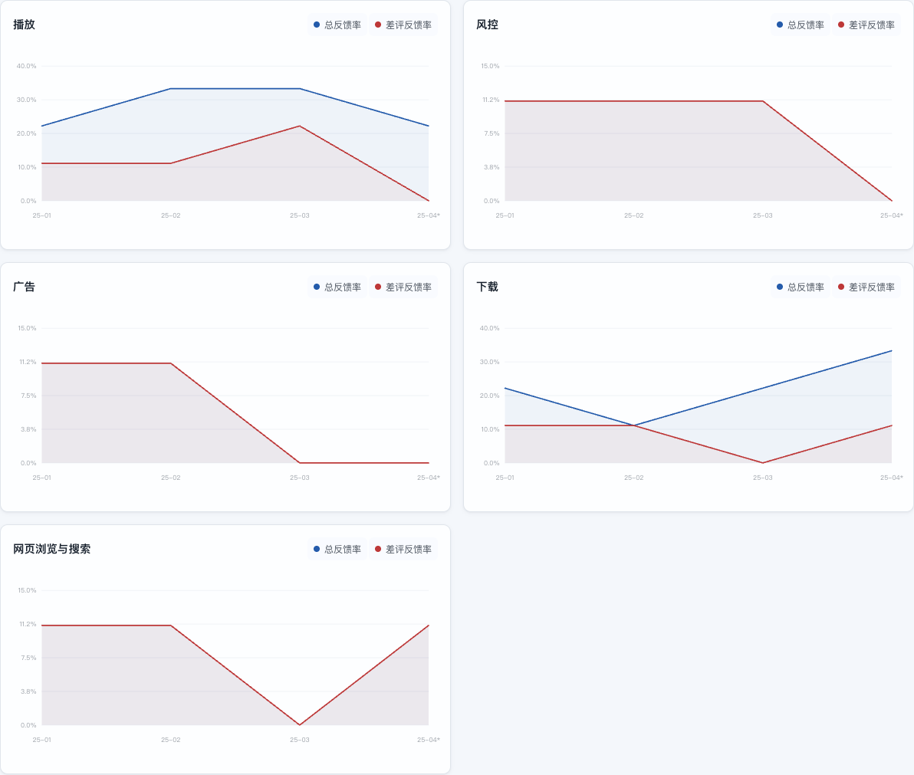
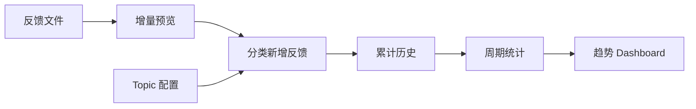

# App Feedback Trends · 用户反馈趋势监测

[](https://github.com/ask6688/app-feedback-trends/actions/workflows/check.yml)

一个可配置的 App 用户反馈长期主题监测工具：导入反馈、定义关注领域，持续累计历史，生成交互式 HTML Dashboard。

它主要回答：**我们长期关注的用户反馈主题，正在怎么变化？** 比如支付相关反馈最近是否增多，播放相关差评是否下降，变化主要来自哪个应用市场。

Python · 本地规则分类 · 增量导入 · HTML Dashboard

## 1. 使用场景与结果

### 从每期反馈，看到长期变化

如果每周只看一份评论列表，很难判断一个主题是偶尔被提起，还是持续受到关注。这个项目把每次导入的数据放进同一份历史，用一致的 Topic 规则和指标，观察多个周期的变化。

**Topic 是你预先定义的关注领域。** 支付、物流、账号、性能都可以成为 Topic；正面反馈也可以命中。例如“视频播放很流畅”属于播放主题，差评情况则单独统计。



> 截图和 [示例 Dashboard](docs/demo/report.html) 均使用人工数据。GitHub 文件页显示 HTML 源码；交互查看方式见下面的「运行与配置」。界面目前为中文。

| 想了解什么 | 在 Dashboard 中看什么 |
| --- | --- |
| 某个主题是否越来越受关注 | Topic 数量、反馈占比，以及月度、周度、近七天日曲线 |
| 相关差评是否增多 | Topic 差评反馈占比、全市场差评率与星级分布 |
| 变化主要来自哪里 | IOS / AND、Android 市场来源对比 |
| 曲线背后具体说了什么 | 按日期、Topic 等筛选原声，查看记录并导出 CSV |

最终得到一份本地 HTML 看板，以及用于核验和后续处理的 JSON / CSV。客服会话可选，按批次展示 Topic 数量与占比，不计算星级差评指标。

### 与 app-user-voice 的区别

| 项目 | 主要回答 |
| --- | --- |
| [app-user-voice](https://github.com/ask6688/app-user-voice) | 本周期具体出现了什么问题？—— Issue Discovery |
| app-feedback-trends | 长期关注的主题正在怎么变化？—— Topic Monitoring |

两者独立运行。本项目持续监测已经定义的 Topic，不自动发现新 Topic、聚类具体 Issue 或生成 AI 总结和周报。

## 2. 数据流程与关键取舍



每次导入先生成预览；确认后，系统只分类新增记录，再基于累计历史重新统计和生成报告。之后导入下一期数据，仍使用同一数据目录。

| 需要处理的问题 | 当前做法 |
| --- | --- |
| 导出文件可能重复或修改已有评论 | 先 `preview` 再 `apply`；已有记录不重分类，变更与歧义候选留待人工核对 |
| 不同产品关注不同主题 | JSON profile 配置简单 Topic；复杂判断可使用 Python 内置 matcher，两者可以共存 |
| 更换规则可能让历史前后失去可比性 | 首批数据后固定 profile；改规则、名称或顺序时使用新数据目录 |
| 报告生成失败，历史可能只写入一半 | 报告成功后才原子提交历史，失败保留原历史和既有报告 |

### 看懂图上的比例

市场的两个 Topic 指标都以**同期全量市场评论**为分母：

- **反馈占比** = 命中该 Topic 的评论数 / 全量评论数。
- **差评反馈占比** = 命中该 Topic 且为 1–3 星的评论数 / 全量评论数。

例如 100 条评论中，20 条涉及支付，其中 5 条为差评：支付反馈占比是 **20%**，支付差评反馈占比是 **5%**。一条反馈可以命中多个 Topic，因此各 Topic 占比相加可能超过 100%。

月度覆盖累计历史，周度观察最近三个月，近七天截至**数据中的最新日期**。未完整的周期会标记；无星级记录保留在全量分母中。详细窗口、合并规则和客服口径见 [指标说明](docs/USAGE.md#指标与结果)。

## 3. 技术与项目结构

分类在本地使用字符串、正则和上下文规则完成，无模型调用。CSV / TSV 核心流程使用 Python 标准库，XLSX 读取使用 openpyxl；Dashboard 使用 HTML、CSS 和原生 JavaScript，无需前端构建。

```text
trends.py                   CLI：预览、提交、生成报告、运行 Demo
trendlib/                   文件解析、增量匹配、Topic 分类与内置规则
profiles/                   默认媒体 preset、简单电商配置示例
scripts/                    数据核验、周期指标、HTML 生成、公开文件检查
templates/dashboard.html    Dashboard 模板
examples/                   人工反馈与客服样例
docs/                       使用指南、截图与人工示例 Dashboard
tests/                      回归检查与人工案例
skills/                     可选 Agent Skill
.github/workflows/          自动检查
```

[使用指南](docs/USAGE.md) · [默认媒体 preset](profiles/media.json) · [电商配置示例](profiles/commerce.json) · [公开范围与验证说明](docs/PUBLIC_SCOPE.md)

## 4. 运行与配置

### 先跑一份完整 Demo

需要 Python 3.10+。在 macOS / Linux 中运行：

```sh
git clone https://github.com/ask6688/app-feedback-trends.git
cd app-feedback-trends
python3 -m venv .venv
source .venv/bin/activate
python -m pip install -r requirements.txt
python trends.py demo
python trends.py serve
```

打开 [http://127.0.0.1:8000/report.html](http://127.0.0.1:8000/report.html)。Demo 导入 72 条人工市场评论和 12 条人工客服会话；重复运行不会重复累计。按 `Ctrl+C` 停止本地服务。

只想先看已有示例，无需安装依赖：在仓库根目录运行 `python3 -m http.server 8000 --bind 127.0.0.1 --directory docs/demo`，打开同一地址。

### 选择或配置自己的 Topic

不传 `--profile` 时使用默认媒体 preset：**播放 → 风控 → 广告 → 下载 → 网页浏览与搜索**。这五类使用内置复杂规则，不代表项目只能监测这些主题。

简单 Topic 可以配置 `keywords`、`requires`、`excludes`、展示名称、启用状态与顺序。例如 [commerce.json](profiles/commerce.json) 定义了「支付 / 物流 / 性能」，可以直接跑通另一套人工样例：

```sh
python trends.py preview --data-dir outputs/commerce \
  --profile profiles/commerce.json --ios examples/commerce.csv
# 查看 outputs/commerce/preview.json，再提交
python trends.py apply --data-dir outputs/commerce --profile profiles/commerce.json
python trends.py serve --data-dir outputs/commerce --profile profiles/commerce.json
```

简单规则使用不区分大小写的子串匹配：至少命中一个关键词；设置 `requires` 时还需命中至少一个上下文词；命中任意排除词则排除。它不推断否定或同义改写。完整 JSON 示例与内置 matcher 用法见 [Topic 配置指南](docs/USAGE.md#自定义-topic)。

### 导入自己的反馈，持续更新

支持 CSV、TSV、XLSX。市场反馈的最小表头如下（`author` 可省略，`star` 可留空）：

```csv
comment_date,star,content,author
2025-01-01,5,订单支付很顺利,synthetic-a
2025-01-02,2,订单扣款后没有确认,synthetic-b
```

先将文件放进 `inputs/`，选择自己的 profile，然后运行：

```sh
python trends.py preview --data-dir outputs/my-app \
  --profile profiles/commerce.json --ios inputs/ios.csv --android inputs/OPPO.csv
# 查看 outputs/my-app/preview.json 中的新增、变更、歧义和解析告警
python trends.py apply --data-dir outputs/my-app --profile profiles/commerce.json
python trends.py serve --data-dir outputs/my-app --profile profiles/commerce.json
```

示例使用电商 profile；按产品需要替换所有命令中的 `--profile`。下次导入继续使用相同 profile 和 `--data-dir`。累计历史与报告保存在该目录，终端会打印 HTML 路径；分享看板时需带上同目录的 `assets/`。

`inputs/`、`outputs/` 已被 Git 忽略，但生成报告仍包含原声，分享前需要自行检查。表头别名、Android 渠道识别、客服导入、去重规则与旧历史迁移见 [使用指南](docs/USAGE.md)。

### 检查与当前边界

```sh
python -B -m unittest discover -s tests -v
python -B scripts/check_public.py
```

测试使用人工数据，覆盖默认与自定义 Topic、增量与去重、失败不提交、空星级及 HTML 数据等；CI 在 Python 3.10 / 3.14 上运行。公开内容以 [文件清单](public-files.txt) 为准。MIT License。

当前边界：

- 平台维度为 IOS / AND；Android 内置识别五个市场，其他来源归为未指定渠道。Dashboard 至少需要一条带日期的市场记录，客服数据可选。
- 简单 Topic 可配置；新增复杂 matcher 需要修改 Python。“已解决”标记仅保存在当前浏览器。
- 输入文件由用户准备，报告在本地生成；项目不负责数据抓取或网站自动发布。

[Agent Skill](skills/app-feedback-trends/SKILL.md) 是可选入口，普通用户按上述 CLI 即可运行。
